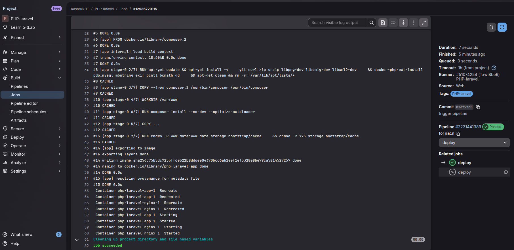
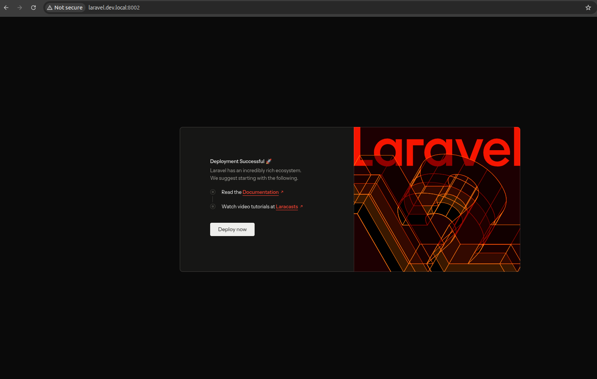
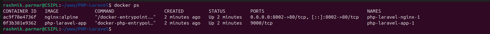
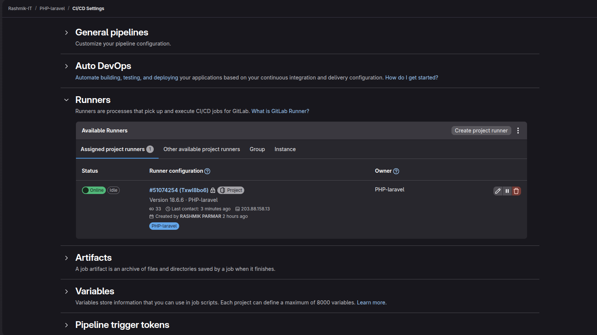

# PHP Laravel DevOps Deployment 🚀

This project demonstrates a complete **DevOps-oriented deployment** of a
Laravel application using **Docker, Nginx, and GitLab CI/CD**.

## 🔧 Tech Stack
- PHP (Laravel)
- Docker & Docker Compose
- Nginx
- GitLab CI/CD (Self-hosted Runner)
- Linux (Ubuntu)

## 📦 Architecture
- Laravel runs inside a PHP-FPM container
- Nginx acts as a reverse proxy
- Docker Compose manages multi-container setup
- GitLab CI pipeline automates build & deployment

## 🔁 CI/CD Flow
1. Code pushed to `main` branch
2. GitLab CI pipeline triggers automatically
3. Docker image is built
4. Containers are deployed using Docker Compose
5. Laravel migrations run automatically

## 🌐 Live Access (Local Network)

## 📸 CI/CD & Deployment Proof

### GitLab Pipeline Success

### Deployment Job

### Laravel Application UI

### Docker Containers

### GitLab Runner

